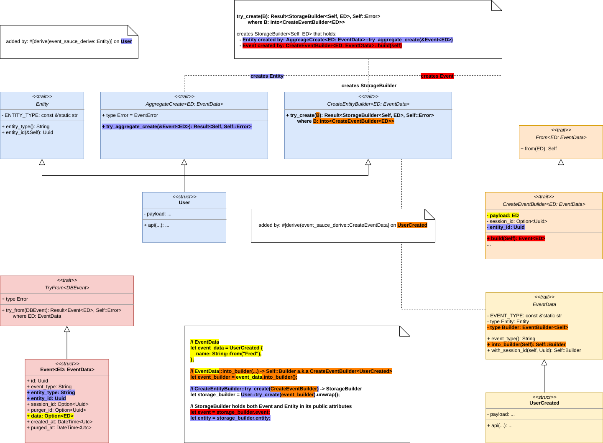

# Examples

## Hello World

* source: [hello-world.rs](./hello-world.rs)

This example demonstrates basic usage of the `event-sauce`. It defines an `Entity` and its creation `Event`. While it
does not deal with update `Event`, example of that would be analogous.

The basic architecture of the example and relevant parts of the `event-sauce` library is shown on the diagram below:

The code of the `main` function creates the `EventData` for the creation `Event`, which is used to instantiate the
`StorageBuilder`. `StorageBuilder` holds both the creation `Event` and the aggregated `Entity`. The `StorageBuilder`'s
`persist` function is then called, which uses simple fake data `Storage` and its associated `Transaction` to store the
`Event` and the `Entity` (the fake `Storage` just dumps the serialized data to `stdout` instead of storing them
anywhere).

